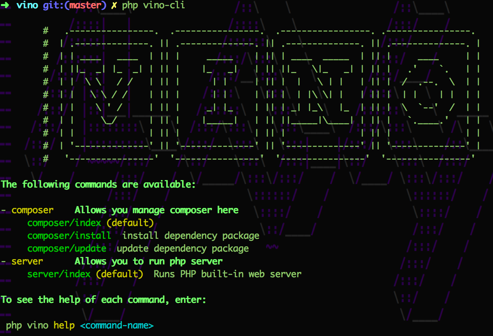
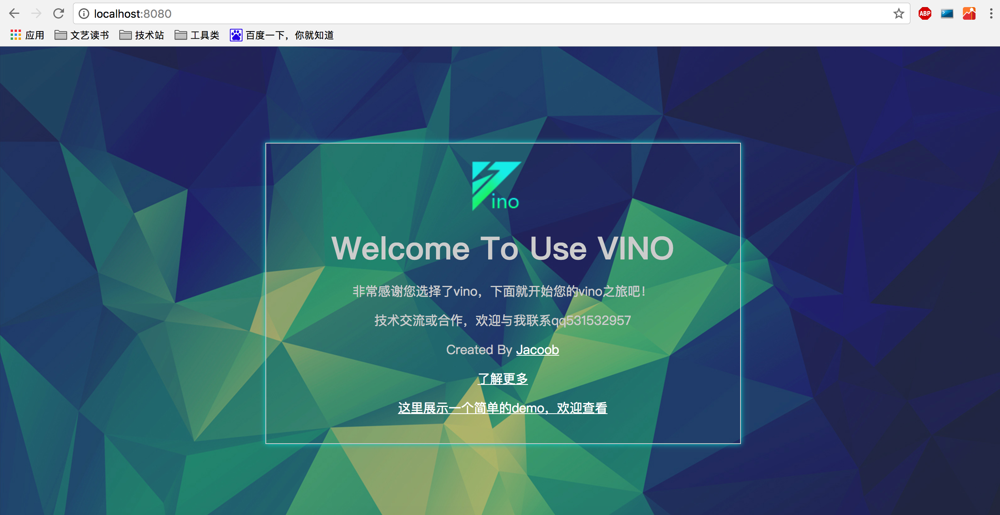

# Vino PHP Framework 1.0.0

Vino is a PHP framework that helps you quick build web applications and APIs.

## Installation

1,Now you can download from this github respository,use git clone https://github.com/jacoobwang/vino.git or click button download zip.either is ok.

2,When you finished download,you should cd your download folder,and run commander 

```shell
php vino-cli
```

you will see :



4,Install dependency by vino-cli

run 

```shell
php vino-cli compser install
```

5,Run php built-in web server

run

```shell
php vino-cli server
```

than a php server maked ,you can visit in your browser!!

you will see:



 So ,congratulations，it's worked!!!

6, Try write some code & enjoy your fun   

---------------------------------

Tips:

> if you run in nginx server,you should modify your nginx.conf and add :

```json
location / {
	try_files $uri $uri/ /index.php?_url=$1&$args;
}
```

> If you run in apache server ,just open rewrite module.Vino user .htaccess file.

## Documentation

You can visit this website to learn more

https://jacoobwang.github.io/vino/vino.html

## Ends

If you have some ideas,welcome contact me by mail 531532957@qq.com ! 

Thank you very much!

